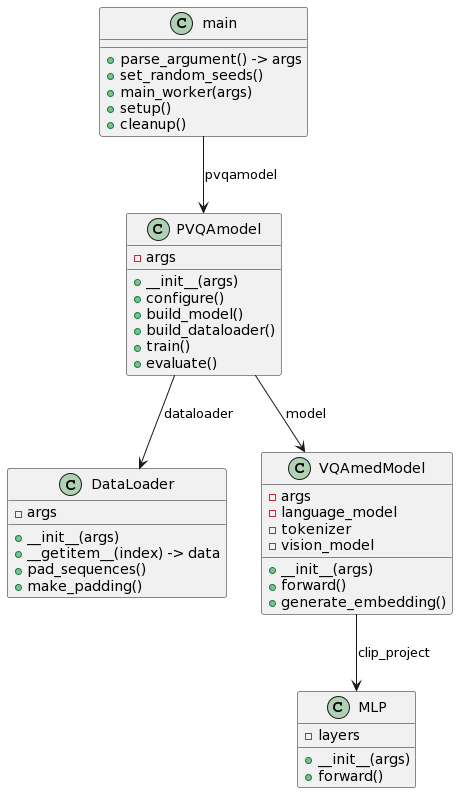

# Pathological-Llama: an Explainable Medical Visual Question Answering System

## Abstract
This thesis introduces Pathological-Llama, an explainable medical visual question answering system that integrates computer vision and natural language processing to accurately interpret medical images through a generative task approach. By addressing the demand for both accu- racy and transparency in medical diagnostics, Pathological-Llama represents an advancement in the application of artificial intelligence within healthcare. This research undertakes a generative task, distinguishing it from traditional classification-based VQA systems, enabling the model to generate detailed, contextually relevant answers to complex medical questions.
Pathological-Llama was developed and fine-tuned using the PathVQA dataset, with a focus on explainability. The system employs the Integrated Gradients method and leverages GPT-4 for in-depth analysis, enhancing the interpretability of its decision-making process. These methods ensure that the system not only achieves high accuracy but also provides transparent explanations for its diagnostics. The effectiveness of Pathological-Llama is demonstrated through testing on previously unseen datasets, achieved impressive metrics with a BERT score of 0.591 and an F1 score of 0.419. These results confirm the model’s robust generalization capabilities and highlight the role of optimizing hyperparameters and visual prefix lengths in enhancing the performance of generative VQA tasks.
Contributing to medical AI and VQA, Pathological-Llama demonstrates how generative models can deliver precise, explainable medical solutions. It establishes a benchmark for reliable, transparent AI in healthcare, aiming to enhance patient care and diagnostics. The evaluation of Pathological-Llama, highlighted by its performance metrics, underscores the value of generative tasks in medical VQA and paves the way for future advancements.

## UML Diagram

## Architecture

## Set up
* mkdir data/model-outputs
* mkdir data/pvqa/CLIPGPT2
* mkdir data/pvqa/CLIPLLAMA
* download data from [this link](https://drive.google.com/drive/folders/1G2C2_FUCyYQKCkSeCRRiTTsLDvOAjFj5) and move to data/pvqa
* run utils/preprocess_vqa_datasets.py

